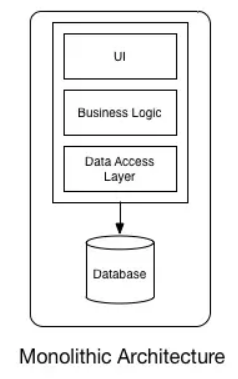

# Problem with Monolithic Architecture
Application are made of multiple components. The components communicate with each other to transmit data, fulfill requests, and keep the application running. 
They are use for small-scaled projects, with simple development flow (submit, changes, review, merge code, continue), centralize management
Since they are tightly coupled components, if a single components fails, then other components will likely fail --> might result in entire application to fail

# Microservice Architecture
On the other hand, we have microservice architecture, where components are loosely coupled, so if a single component fails, the others continue to work 

# Type of Services
## Managed Services
The services that require you to manage infrastructure management tasks like patching, backup and repair. These services grant you virtual access to the underlying operating system and servers. With managed services, you are **responsible for scaling and building for high availability**
## Fully Managed Services
The services that automate infrastructure management task that AWS handles, like patching, backup and repair. These services do not grant you any virtual access to the underlying operating system or servers. With a fully managed service, you are still **responsible for scaling and building for high availability**
## Serverless Services
The services, practices and strategies that you can use to build more agile applications. In this way, you can innovate and respond to change faster. With serverless services, AWS handles infrastructure management task like capacity provisioning and patching so that you can focus on building applications that serve your customers. Serverless services come with **automatic scaling, built-in high availability**, and **pay-for-value** billing model

# Core Services
[[VPC (Virtual Private Cloud)]]
[[Amazon EC2]]
[[Amazon RDS]]
[[Amazon SNS]]
[[Amazon CloudWatch]]
[[AWS Lambda]]
[[Amazon S3]]
[[Amazon DynamoDB]]
[[AWS Identity and Access Management]]