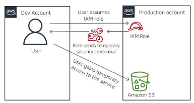

#services 

IAM is an **centralized security management system** that is included in every AWS Account to control identity access to AWS services. By attaching **IAM permission policies** to identifies, you can manage which services each identity can access and the kind of actions the identity can perform

## [[IAM User]]
It's **an identity** that you create in AWS, represents the person or service who uses the IAM user to interact with AWS
## IAM Group
It's a **collection of IAM Users**. You can user groups to specify permissions for a collection of users, which can make those permissions easier to manage for those users
## [[IAM Role]]
**An identity with permission policies** that attached to it. An IAM user or service can assume these policies to temporarily take on on different permissions for a specific task 
# What problem does it solve?
User having more access than they should
**IAM is built by using the principle of least privilege**. This principle states that **an identity will not have access to any AWS service UNTIL you grant the identity access**. By this method, no one should be able to provision or access resources that you have not explicitly granted them access to
# Benefits
- Simple interface, making it easy to grant and control user access to AWS Services
- It has many system-generated policies that you can use, and you can create additional custom policies that meet the needs of your specific requirements
# Architect a Cloud Solution using IAM
You can grant someone from a different AWS account access to your account to perform a specific task 

Here we have user in Dev account is assuming a role in the production account. The role return a temporary security credential. It grants the user temporary access to the AWS service based on the policy that is attached to the role
# How to use
## Fine-grained access control
Your users can use IAM to control access to AWS service APIs and to specific resources. You can use IAM to add specific conditions for how a user can use AWS resources or their originating IP address. These conditions might also determine whether they are using **Secure Sockets Layer (SSL)** or whether they have authenticated with a multi-factor authentication device
## Multi-factor authentication
Use to protect you AWS environment by using **[[AWS multi-factor authentication]]** (MFA). MFA is a security feature available at **no extra cost** that augments user name and password credentials. MFA requires users to prove physical possession of a hardware MFA token or MFA-enabled mobile device by providing a valid MFA code
## Analyze access
IAM helps your analyze access across AWS environment. Your security teams and administrators can quickly validate that your policies only provide the intended public and cross-account access to your resources. You can also easily identify and refine your policies to allow access to only the services that being used. This practice helps you to better adhere to the principle of least privilege 
## Integrate with your corporate directory
IAM can be used to grant your employees and applications federated access to the [[AWS Management Console]] and AWS service APIs. It uses your existing identity systems such as [[Microsoft Active Directory ]]. You can use any identity management solution that supports **Security Assertion Markup Language (SAML) 2.0** . You can also feel free to use one of the AWS federation samples, such as AWS Management Console **single sign-on (SSO)** or **API federation** 

# What should be kept in mind
AWS evaluate policies depends on the types of policies that apply
## Implicit deny
**denies** a user, group or role access to a service. This policy is **the default setting for all new identities** when they are created. For the identity to gain access to a service, an **explicit allow** IAM policy must be attached to the identity. The ***explicit allow then OVERRIVE the implicit deny***
## Explicit allow
**An explicit allow will OVERRIDE an implicit deny**. The explicit allow can grant **full access** or **partial access**, depending on the IAM policy that you attach
## Explicit deny
An IAM policy that you attach to a user, group or role. It restricts that identity from having access to the service or to specified actions withing the service. An explicit deny is similar to and implicit deny, with one important distinction: ***An explicit allow CANNOT OVERRIDE an explicit deny***

E.g Suppose that a user had and explicit allow to full access to Amazon S3. The user is then put into a group that has an explicit deny to delete files from Amazon S3. The result is that the user will have full access in everything Amazon S3 ***with the exception of the ability to delete files***.
# Cost
IAM is a service in your AWS Account that is offered at **no additional charge**. You are **charged only when you access other AWS services by using your IAM users' credentials** 