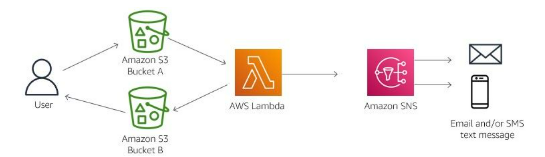

#services 

AWS Lambda is a serverless compute service that you can use to run function code without provisioning or managing servers. You can use Lambda to run function code for virtually any type of application or backend service. You upload your code, and Lambda takes care of everything that is required to run and scale your code with high availability.

# What problem does it solve?
- You don’t have to worry about setting up or maintaining servers. Lambda automatically runs your code whenever needed.
- Upload your code as a **.zip file or container image**. Lambda takes care of **running it when triggered**.
- Lambda **adjusts compute power** based on the number of requests. It can handle **small or large amounts of traffic** without manual intervention.
- Over **200 AWS services and SaaS applications** can trigger Lambda. You can also call Lambda functions from **web or mobile apps**.

# Benefits
- **AWS Lambda is SERVERLESS**, so you have no servers to manage. Lambda automatically runs your code without requiring you to provision or manage infrastructure. You write the code and upload it to Lambda either as a .zip file or as a container image.
- AWS Lambda has built in continuous scaling that scales your application by running code in response to each event. It scales precisely with the size of the workload, from a few requests per day to hundreds of thousands per second.

# Architect a cloud solution using AWS Lambda
Configure Lambda to perform an action when an event occurs in a triggering service

In this example, a user uploads a photo into Amazon S3 - Bucket A. This action triggers the Lambda code to run and resize the photo and place the photo in Amazon S3 - Bucket B. From Bucket B, the user can download the resized photo. Lambda then sends an email or a text message to the appropriate users to alert them that the photo is ready to download.

# How to use Lambda
## Web applications
By combining AWS Lambda with other AWS services, developers can build powerful web applications that automatically scale up and down. These applications run in a highly available configuration across multiple data centers -with zero administrative effort required for scalability, backups, or multi-data redundancy.
## Data processing
You can use AWS Lambda to execute code in response to triggers such as changes in data, shifts in system state, or actions by users. Lambda can be directly triggered by AWS services such as [[Amazon S3]], [[Amazon DynamoDB]], [[Amazon Kinesis]], [[Amazon SNS]], and [[Amazon CloudWatch]], or it can be orchestrated into workflows by AWS Step Functions. Thus, you can build a variety of real-time serverless data processing systems.
## Real-time file processing
You can use [[Amazon S3]] to trigger AWS Lambda to process data immediately after an upload. You can also connect to an existing [[Amazon EFS]] (Amazon Elastic File System) filesystem directly, which enables massively parallel shared access for large-scale file processing. For example, you can use Lambda to thumbnail images, transcode videos, index files, process logs, validate content, and aggregate and filter data in real-time.
## Real-time stream processing
You can use AWS Lambda and [[Amazon Kinesis]] to process real-time streaming data for application activity tracking, transaction order processing, and click stream analysis. You can also use it for data cleansing, metrics generation, log filtering, indexing, social media analysis, and Internet of Things (loT) device data telemetry and metering.

# What should be kept in mind
**AWS Lambda has a 15-minute limit on its runtime for each execution**. If your computing needs require more than 15 minutes for runtime, then you would need to use an EC2 instance instead of Lambda.
# Cost
With AWS Lambda, you **pay only for what you use**. You are **charged based on the number of requests** for your Lambda functions and **the duration**, the **time it takes for your code to run**. 
The AWS Lambda always free usage tier includes **1M free requests per month** and **400,000 GB-seconds of compute time per month**. 
No charge is incurred when your code is not running.