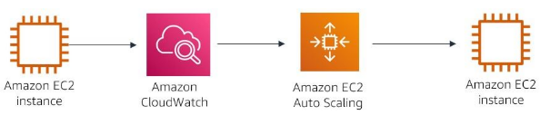

#services 

Amazon CloudWatch is a monitoring and observation service that is built for DevOps engineers, developers, security engineers, and IT managers. CloudWatch provides you with data and actionable insights to monitor your applications, respond to system-wide performance changes, and optimize resource utilization. You get a unified view of operational health.

# What problem does it solve?
Amazon CloudWatch solves the problem of responding to events and alarms, as they occur in your architecture. Amazon CloudWatch collects monitoring and operational data in the form of logs, metrics, and events. It provides you with a unified view of AWS resources, applications, and services that run on AWS and on-premises servers. You can use CloudWatch to detect anomalous behavior in your environments, set alarms, and visualize logs and metrics side by side. Use it to take automated actions, troubleshoot issues, and discover insights to keep your applications running smoothly.
# Benefits
- CloudWatch collects **metrics and logs** from all your AWS services, applications, and even on-premises servers.
- This allows you to **monitor everything in one place** instead of checking multiple tools.
- You can track important **performance metrics** like **CPU usage and memory consumption**.
-  Helps you **visualize** and understand how your resources are performing.
- You can **set alarms** to notify you when something goes wrong.
- CloudWatch can also take **automatic actions** (like restarting a server or scaling up resources) to **prevent issues before they impact your business**.
# Architect a cloud solution using CloudWatch
Using CloudWatch to monitor the CPU utilization and take action

In the diagram, CloudWatch receives data on the EC2instance CPU utilization. When the CPU goes over a specified percent, CloudWatch triggers Amazon EC2 Auto Scaling to provision an additional instance to help with the workload. Therefore, the first instance isn't overloaded.
# How to use CloudWatch
## Infrastructure monitoring and troubleshooting 
You can use CloudWatch to monitor key metrics and logs, visualize your application and infrastructure stack, and create alarms. It correlates metrics and logs to understand and resolve the root cause of performance issues in your AWS resources.
## Proactive resource optimization
CloudWatch alarms watch your metric values against thresholds that you specify, or that CloudWatch creates by using machine learning models to detect anomalous behavior. For example, if an alarm is triggered, CloudWatch can take action automatically to enable [[Amazon EC2 Auto Scaling]] or stop an instance. In this way, you can automate capacity and resource planning.
## Application monitoring 
CloudWatch can monitor your applications that run on AWS(on Amazon EC2, containers, and serverless) or on-premises. CloudWatch collects data at every layer of the performance stack, including metrics and logs on automatic dashboards.

# What need to be kept in mind
Some services provide **basic CloudWatch monitoring at no additional charge** with the option to **upgrade to detailed monitoring**, which **comes with a charge**. For example, EC2 instances, by default, are enabled with basic CloudWatch monitoring. Thus, data is available **automatically in 5-minute periods**. If you decide to upgrade to detailed CloudWatch monitoring on your instances, data is available in 1-minute periods instead of 5-minute periods.
# Cost
Amazon CloudWatch **does not require an upfront commitment** or **minimum fee**; you **pay for what you use**. You are **charged at the end of the month** for your usage. Amazon CloudWatch charges you for alarms, custom events, metrics collection and dashboards that you set up. However, you can get started with Amazon CloudWatch for free. Most AWS services ([[Amazon EC2]], [[Amazon S3]], [[Amazon Kinesis]], and others) send metrics automatically for **FREE** to CloudWatch. Many applications should be able to operate within these free tier limits.