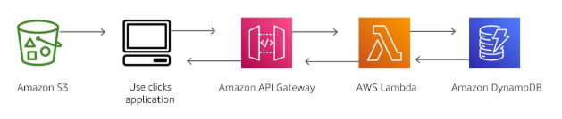

#services 
Amazon DynamoDB is **a SERVERLESS non-relational database** that can store and retrieve any amount of data and serve any level of request traffic. You can scale your database tables’ throughput capacity up or down without downtime. You can use the AWS Management Console to monitor resource utilization and performance metrics.
# What problem does it solves ?
Amazon DynamoDB is a **fully managed NoSQL database** that handles all the complex administrative tasks for you
- No need to set up **physical or virtual servers** to store data
- DynamoDB **adjusts automatically** based on your app’s data and traffic
- AWS manages **database replication, backups, and updates**
# Benefits
- Providing consistent, single-digit millisecond response times at any scale
- DynamoDB is a serverless with no servers to provision, patch, or manage and no software to install, maintain, or operate
- DynamoDB supports **ACID transactions** so that you can build business-critical applications at scale. DynamoDB encrypts all data by default and provides fine-grained identity and access control on all your tables
# Architect a Cloud Solution using DynamoDB
You can use Amazon DynamoDB to store an application's stored data

In this example, a user accesses an application that is stored in Amazon S3. The user chooses an option to receive data. Amazon API Gateway will then trigger Lambda to retrieve data from DynamoDB and send it back to the user's interface
# How to use 
## Retail
Many companies in the retail space use common DynamoDB design patterns to deliver consistently low latency for mission-critical use cases. Being free from scaling concerns and operational burden is a key competitive advantage. It provides for high-velocity, extreme-scaled events such as Amazon Prime Day, whose magnitudes are difficult to forecast. By scaling up and down, these customers pay only for the capacity that they need. They can keep precious technical resources focused on innovations rather than operations.
## Gaming
Companies in the gaming vertical use DynamoDB in all capabilities of game platforms, including game state, player data, session history, and leaderboards. The main benefit that these companies get from DynamoDB is its ability to scale reliably to millions of concurrent users and requests while ensuring consistently low latency. This latency can be measured in single-digit milliseconds. 
## Banking
Banking and finance companies use DynamoDB to build more cloud-native applications to increase agility, reduce time to market, and minimize operational overhead. These companies also use DynamoDB to ensure the security, reliability, and continued high availability of their applications.
## Ad Tech
Companies in advertising technology (ad tech) use DynamoDB as a key-value store for storing various kinds of marketing data. Examples of such data would include user profiles, user events, clicks, and visited links.
# What should be kept in mind 
Differences between **Relational Database** and **Non-relational database**
## Relational Database
Relational databases **store data in rows and columns**. **Rows contain all the information about one entry**, and **columns are the attributes** that separate the data points. A relational database
**schema is fixed**: columns must be locked before data entry. You can amend schemas if the database is altered entirely and taken offline. Data in relational databases is **queried by using structured query language (SQL)**, which can have complex queries. **Relational databases scale vertically by increasing HARDWARE power**. Relational databases are commonly used for traditional applications, enterprise resource planning (ERP), customer relationship management (CRM), and e-commerce.
## Non-relational Database
Non-relational databases **store data by using one of many storage models**, including **key-value pairs**, **documents**, and **graphs**. Non-relational **schemas are dynamic**, and information can be added rapidly. Each row doesn't have to contain data for each column. Data in non-relational databases is **queried by focusing on collections of documents**. **Non-relational databases scale horizontally by increasing SERVERS**. Key-value databases are commonly used for internet-scale applications, real-time bidding, shopping carts, and customer preferences.
# Cost
DynamoDB **charges for reading, writing, and storing data** in your DynamoDB tables, **along with any optional features you choose to enable**. 
**DynamoDB has two capacity modes (on-demand and provisioned)**, both of which come with specific billing options for processing reads and writes on your tables.