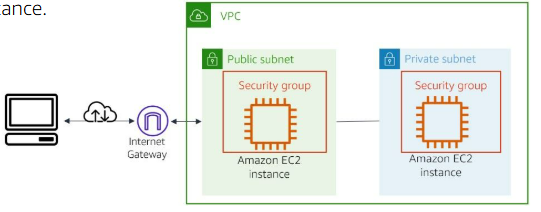

#services 

Amazon Elastic Compute Cloud (Amazon EC2) is a **web service** that provides **secure, resizable compute** capacity in the cloud. It is designed to make web-scale cloud computing easier for developers. You can use the simple web interface of Amazon EC2 to obtain and configure capacity with minimal friction. It provides you with complete control of your computing resources, and you can run it on the proven computing environment of Amazon.

# What problem does it solve?
Amazon EC2 solves **the problem of predicting upfront needs**. Therefore, you don't need to know how much compute capacity or how much hard drive volume you will need when you set up your architecture. You can scale up and down as you need to.

# Benefits
- You can launch an EC2 instance (a virtual server) in just a few minutes.
- You get to choose the right **CPU, storage, and operating system** that best fits your needs, making it flexible for different applications.
- You can increase or decrease the storage (volume size) and even change the type of instance (for example, upgrading to a more powerful server) **without stopping or deleting** your current instance.
- Amazon EC2 allows you to **scale up or down** depending on your workload.
- This means you don’t need to buy extra servers just for busy seasons—you can add more capacity when needed and reduce it when demand drops, saving costs.

# Architect a Cloud solution with EC2
With Amazon EC2, you can architect a solution to build a multi-tier application. To construct this solution, you create an instance in a public subnet that hosts a website with a security group that allows internet traffic in and out. Then, you can create another instance that hosts a database in a private subnet with a hardened security group. This security group restricts internet traffic, but allows the website instance to access the database instance.

# How to use EC2
## Host multi-tier applications
Amazon EC2 can be used to **create multi-tier web applications**. With security groups, you control the kind of port traffic that can reach your instances. You configure your security group and attach it to your instances, and you control the traffic that can enter each layer of your architecture.
## Back-up and disaster recovery
With Amazon EC2, you can create a **backup instance** if your main instances fail. In the event of a failure, you can **scale up your backup instances** until you get your main instances back online. Then, **scale your backup instances back down** when recovery of your main instances is complete. Amazon EC2 instances can act as a backup for cloud or on-premises instances.
## On-demand computing
Amazon EC2 lets you provision instances to **perform computing jobs and terminate them when your are done**. This arrangement can save you a lot of money, if you only need the computing resource for a few hours, days, or weeks.
## Host databases
AWS offers fully managed and serverless database services ([[AWS Core Services#Type of Services]]) that you can provision for all your database needs. However, with both fully managed services and serverless services, you don't have access to the operating system of the database. But you can **host your own database on an EC2 instance**, if your company requires you to have that access.

# What need to be kept in mind
If you stop an instance, the Amazon Elastic Block Store([[Amazon EBS]]) volume that is attached will retain your data. ***You will still be charged for the use of the volume***. However, if you terminate the instance, then all your data on the volume will be permanently deleted. The volume will return to AWS for available use to other AWS customers.

# Cost
## On-demand Instances
With On-Demand instances, you **pay for instances only for the amount of time that you use them**. No long-term commitments or upfront payments are required. You can increase or decrease your compute capacity depending on the demands of your application and pay only for the time that you use them. 
**Use case:** Short-term computing workloads that cannot be interrupted; and users that need low-cost computing without any upfront or long-term commitment.
## Spot Instances
You can use Amazon EC2 Spot Instances to take advantage of unused Amazon EC2 capacity in the AWS cloud for a discount. You can save up to 90 percent compared to On-Demand prices. To get a Spot Instance, you submit a request with the instance specifications and the maximum price that you are willing to pay per hour. When a Spot Instance is available at your submitted price, you will have access to the instance. 
**Use case:** Workloads that can be paused and restarted when computing prices meet your budget for Spot Instances.
## Reserved Instances
Reserved Instances provide you with a significant discount(up to 75 percent) compared to On-Demand Instance pricing. With Reserved Instances, you commit to paying for the instance for 1 or 3 years, depending on the conditions you agree to when purchasing them. 
**Use case:** Computing needs with a steady amount usage of up to 1 year or more.