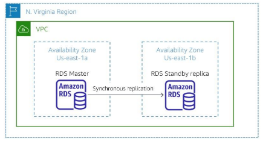

#services 

Amazon Relational Database Service (Amazon RDS) is **a distributed relational database managed service.** It is cloud-based and designed to simplify the setup, operation, and scaling of relational databases. Administrative processes like **patching, backing up databases, and enabling point-in-time recovery are managed automatically**.

# What problem does it solve?
Amazon RDS solves the problem of purchasing a database with a capacity that is either too large or too small for your use over time. With Amazon RDS, you can scale up and down based on your database capacity needs. As a result, you are never paying for more database capacity than you need.
# Benefits
- You don’t need to worry about setting up the hardware or managing the database software.
- With just a few clicks or an API call, you can easily **scale** (increase or decrease) the database’s compute power and storage based on your needs.
- - Amazon RDS can handle **demanding applications**, meaning it’s built to support high-performance databases.
- You can run your databases in **Amazon [[VPC (Virtual Private Cloud)]]**, which allows you to **isolate** (keep private) your database from the rest of the network.
- Alternatively, you can connect your database securely to your existing infrastructure using an **encrypted VPN**.
# Architect a Cloud solution with RDS
You can architect a solution to build for fault tolerance by configuring Amazon RDS for **Multi-AZ deployment.** To accomplish this task, you place your master RDS instance in one Availability Zone, and a standby replica of the master in another Availability Zone. If the primary fails, then the standby automatically becomes the new master and your system remains active.

# How to use RDS
## Web and Mobile applications
Web and mobile applications that are built to operate at very large scale need a database with high throughput, massive storage scalability, and high availability. Amazon RDS fulfills the needs of such highly demanding applications with room for future growth. Because Amazon RDS does not have any licensing constraints, it perfectly fits the variable usage pattern of these applications.
## Ecommerce applications
Amazon RDS offers small and large ecommerce businesses a flexible, secured, highly scalable, and low-cost database solution for online sales and retailing. Amazon RDS provides a managed database offering to help e-commerce companies meet payment card industry (PCI) compliance and focus on building high quality customer experiences. They don't need to worry about managing the underlying database.
## Mobile and online games
Mobile and online games need a database platform with high throughput and high availability. Amazon RDS manages the database infrastructure so game developers don't have to worry about provisioning, scaling, or monitoring database servers. Amazon RDS provides familiar database engines that can rapidly grow capacity to meet user demand.

# What need to be kept in mind
**Amazon RDS is fully managed**. "Fully managed" means that AWS automates the maintenance and security of the database instance **without your doing anything**. However, ***you might need access to manage the operating system and update security patches yourself***. If so, then you can provision an EC2 instance and use it to host your own database. Suppose that you decide to host your own database on anEC2 instance. Then, you are responsible for many of the automated tasks that Amazon RDS would automatically perform for you.
# Cost
Amazon RDS pricing follows **the pay-only-for-what-you use model**. It has no minimum fee. You can pay for Amazon RDS by using [[Amazon EC2#On-demand Instances]] or [[Amazon EC2#Reserved Instances]], similar to what you learned about the Amazon EC2 options. Amazon RDS provides a selection of instance types that are optimized to fit different relational database use cases.