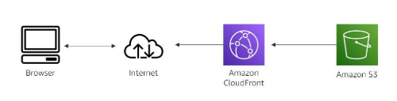

#services 
Amazon S3 is object storage that is built to store and retrieve any amount of data from anywhere at any time. It's a simple storage service that offers **industry-leading durability, availability, performance, security, and virtually unlimited scalability** at **LOW COST**.

# What problem does it solve?
- You don’t have to guess how much storage you need. Just create a **bucket** and upload as many files as you want. Amazon S3 **automatically scales** as your storage needs grow.
- Every file you upload is **automatically copied** to multiple locations within the same AWS Region. This means your data is **highly available** (easy to access) and **durable** (safe from data loss).

# Benefits
- Amazon S3 offers you **industry-leading performance, scalability, availability, and durability** that you can use to easily build applications that use cloud native storage. As a result, you consistently have your data when you need it.
- Because Amazon S3 is **SERVERLESS**, it is **highly scalable**. Therefore, you can start small and grow your application as you want, with no compromise on performance or reliability.
- Amazon S3 also has **unmatched security, compliance, and audit capabilities** in the cloud.
# Architect a cloud solution using Amazon S3
Using Amazon S3 to host a static website anywhere in the world

In this example, Amazon S3 is being used to host a static website. The website content is uploaded to Amazon S3 and directed to [[Amazon CloudFront ]] (a content delivery service) to deliver the content to the internet. Users can then access the website on their browser.

# How to use S3
## Backup and restore
Amazon S3 can be used to build scalable, durable, and secure backup and restore solutions to augment or replace existing on-premises capabilities.
## Disaster recovery
You can protect critical data, applications, and IT systems with Amazon S3 that are running in the AWS Cloud or in your on-premises environment. You can avoid the expense of a second physical site.
## Archive
Retire physical infrastructure, and archive data with **Amazon Simple Storage Service Glacier** and **S3 Glacier Deep Archive**. These S3 storage classes retain objects long-term at the lowest rates. You create an **S3 Lifecycle policy** to archive objects throughout their lifecycles, or upload objects directly to the archival storage classes.
## Data lakes and big data analytics
Accelerate innovation by building a data lake on Amazon S3, and extract valuable insights by using query-in-place, analytics, and machine learning tools. As your data lake grows, use **S3 Access Points** to easily configure access to your data, with specific permissions for each application or set of applications.

# What need to be kept in mind
Amazon S3 is designed for **object storage**, ***not block storage***. 

**Object storage** is a storage option that is meant for **read-intensive (read often)** files that are not written to. If the file needs a change, then the file can be **overwritten**. Examples of object storage are pictures, videos, documents, and static websites. 

**Block storage** is a more structured set of data hosting that is **often written** to. Examples of object storage are pictures, videos, documents, and static websites. ***Amazon S3 is NOT designed for these uses***. Amazon offers [[Amazon EBS]] (**Elastic Block Store**) to meet these needs.
# Cost
With Amazon S3, you **pay only for what you use.** It has no minimum fee. Some prices **vary across Amazon S3 Regions**. Billing **prices are based on the location** of your S3 bucket.