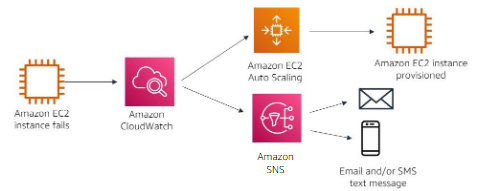

#services 
Amazon Simple Notification Service (Amazon SNS) is a webservice that makes it easy to set up, operate, and send notifications from the cloud. It provides developers with a highly scalable, flexible, and cost-effective capability to publish messages from an application and immediately deliver them to subscribers. These subscribers can be notification recipients or other applications.

# What problem does it solve?
Amazon SNS solves the problem of the appropriate subscribers not getting important that they should be aware of, as events occur in their applications of infrastructure
# Benfits
- You can use Amazon SNS to send messages or notifications directly to users across 200 countries. Messages can be sent with SMS text messages, mobile push on Apple, Android, and other platforms, or email(SMTP).
- Amazon SNS uses a number of strategies that work together to provide message durability. If a subscribed endpoint isn't available, Amazon SNS initiates a message delivery retry policy to resend the message.
# Architect a Cloud solution using SNS
You can use SNS to create a solution to notify you of failures in your architecture

In this diagram, an [[Amazon EC2]] instance fails and [[Amazon CloudWatch]] is notified. CloudWatch then triggers an action to create a new instance through [[AWS Auto Scaling]]. At the same time, CloudWatch triggers Amazon SNS to notify the appropriate subscribers, so that they can investigate the issue further.
# How to use SNS
You can create **topics**. A topic is an access point, which identifies a specific subject or event type. SNS topics are defined as standard topics or **First-in-First-out (FIFO)** topics
## Standard topics
Standard topics can be used in many scenarios if your application can process messages that arrive more than once and out of order. Examples include fanning out messages to media encoding, fraud detection, tax calculation, search index, and critical alerting systems.
## FIFO topics
FIFO topics are designed to enhance messaging between applications when the order of operations and events is critical, or where duplicates can't be tolerated. Examples include fanning out messages to bank transaction logging, stock monitoring, flight tracking, inventory management, and price update systems.
# What need to be kept in mind
Amazon SNS **CANNOT automate messages by itself.** It must work with a service such as [[Amazon CloudWatch]] or [[AWS Lambda]] that can monitor what is going on in your architecture. The service must also be able to trigger Amazon SNS to send a notification, based on your system's configurations.
# Cost 
Amazon SNS has **no upfront fees**, **no required commitments**, and **no long-term contracts**. You **pay only for what you use**, based on the type of topic that is used.