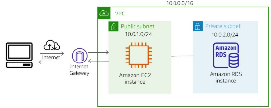

#services

Amazon Virtual Private Cloud (Amazon VPC) is a service that lets you create a private, customized network inside AWS. It acts like your own personal data center in the cloud, where you control the network settings.

With Amazon VPC, you can set up different sections (called subnets) in your network:
- **Public Subnet:** A section where resources like web servers can be accessed from the internet. This is useful for hosting websites and applications.
- **Private Subnet:** A section for backend systems like databases or internal servers. These do not have direct internet access, keeping them more secure.

To enhance security, Amazon VPC includes multiple protective layers:
- **Security Groups:** Act like firewalls that control what kind of traffic is allowed to and from specific resources (like EC2 instances).
- **Network ACLs (Access Control Lists):** Provide additional rules for controlling traffic at the subnet level.

# What problem does VPC solved?
Amazon VPC provides features that you can use to increase and monitor the security for your virtual private cloud (VPC) **ON DEMAND**. Therefore, you can create a data center as you need it and terminate it when you no longer need it.

# Benefits
- Amazon VPC allows you to filter incoming and outgoing traffic at both the individual instance level (using security groups) and the subnet level (using network ACLs). This helps protect your resources from unauthorized access.
- Setting up Amazon VPC is straightforward, so you don’t have to spend too much time configuring it. This allows you to focus more on developing and running your applications rather than managing networking details.
- With Amazon VPC, you can customize your virtual network. You can: 
	Define your own **IP address range**
	Create and manage **subnets**
	Set up **route tables** to control how traffic moves within your network and to external gateways.

# Architect a Cloud solution using VPC
The diagram shows how you can use a VPC to build a solution that has both a public subnet and a private subnet. The public subnet has an EC2 instance that hosts a web application that has access to the internet. The private subnet has an RDS instance that is protected from direct access to the internet.

# How to use VPC
## Host a simple website
Use Amazon VPC to host a basic web application, such as a blog or simple website, you will gain the additional layers of privacy and security that the VPC configuration options provide
## Host multi-tier web applications
Use VPC to host multi-tier web application and strictly enforce access and security restrictions between your web servers, application servers, and databases. To achieve this result, you launch web servers in a publicly accessible subnet while running your application servers and databases in private subnets. This technique will ensure that application servers and databases cannot be directly accessed from the internet.
## Backup and recover
By using Amazon VPC for disaster recovery, you receive all the benefits of a disaster recovery site at a fraction of the cost. You can periodically back up critical data from your data center to as mall number of Amazon EC2 instances. Alternatively, you can import your virtual machine images to Amazon EC2. To ensure business continuity, you can use Amazon VPC to quickly launch replacement compute capacity in AWS. When the disaster is over, you can send your mission-critical data back to your data center.
## Extend your corporate network
You can use a VPC to move corporate applications to the cloud or launch additional web servers. You can also use a VPC to add more compute capacity to your network by connecting your VPC to your corporate network. Because your VPC can be hosted behind your corporate firewall, you can seamlessly move your IT resources into the cloud. You don't need to change how your users access these applications.

# What need to be kept in mind
When you create a new Amazon VPC, you have the option to create one by using a **template** or create one **from scratch**. When you create one from scratch, automatically it will create a route table, a network ACL, and a security group. Then, you configure them according to your needs. If you must delete a VPC, be sure to **first terminate** any EC2or RDS instances that you **have provisioned in the VPC**.

# Cost
An Amazon VPC **doesn't cost you anything at a basic level**. In fact, when you set up your AWS account, you are given a default VPC. A VPC consists of many components that do not cost you anything, **such as subnets, route tables, network ACLs, security groups, and an internet gateway**. However, you can also add features to your Amazon VPC such as a **NAT gateway and elastic IPs that do have associated charges**. Also, any service that you place in your Amazon VPC, such as [[Amazon EC2]], will carry with it the associated cost for that service.