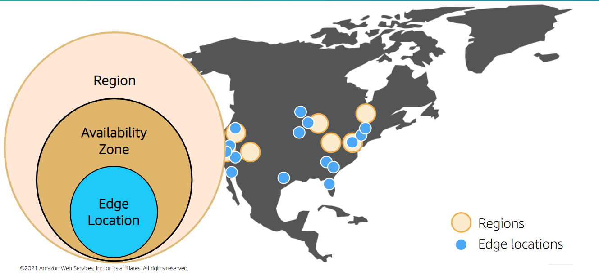

#terms 

# Region
**Physical location around the world where data centers are clustered together**
A group of logical data centers is called an Availability Zone
Each AWS Region consist if multiple, isolated and physically separated Availability Zones within a geographic area
# Availability Zone
An Availability Zone is a **zoned area within a Region that harbor one or more data centers** (typical 3). Availability Zones house all the hardware devices that AWS offers

They are physically separated by a meaningful distance (up to 100km or 60miles) from any other Availability Zone in the Region

Availability Zones are **Interconnected** with high-bandwidth, low-latency  networking to provide low-latency networking between zones that is sufficient to accomplish synchronous replication (same time replication)
# Local Zones
These act like mini-data centers or "extended" Availability Zones. They allow you to run full AWS services—such as EC2, EBS, and VPC—in specific metropolitan areas (like Houston or Los Angeles) that are far from a main AWS Region.
# Point of Presence (PoP)
## Edge Locations
Edge locations are connected to the AWS Regions through the AWS network across the globe. They link with tens of thousands of networks for **improved origin fetches and dynamic content acceleration** 

**Edge locations cache copies of your content for faster delivery to user at any location**. They support AWS services like **Amazon Route 53** and **Amazon CloudFront**
## Regional Edge Caches
Regional Edge Caches are **larger cache locations** that sit between **Edge Locations** and **AWS Regions**. They reduce the frequency of requests sent back to the origin by **caching less frequently accessed content** for longer periods.

**Regional Edge Caches improve cache hit ratios and reduce latency** for users by serving content that is not available at nearby Edge Locations. This also helps **lower load on origin servers** and improves overall content delivery performance.

They primarily support **Amazon CloudFront** by acting as an additional caching layer, ensuring content can still be delivered efficiently even when it is not cached at the closest Edge Location.

> Up to now, AWS has launched **38 Regions**, with **120 Availability Zones** and over **700 Points of Presence**

# Why Do These Exist?
When building your architecture in the cloud, it is important to plan for failure, you want a plan in place to resolve any failures that might occur
> [[Planning for Failure]]
> [[High Availability]]
> [[Security and Compliance]]

