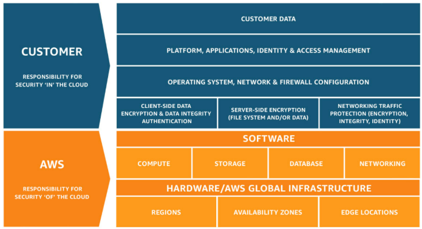

# Customers responsible for the security IN the cloud
They responsible for everything that they created and put **IN** the AWS Cloud (manage content, security requirements, services you use, who have access to that content)

For example, a service such as Amazon Elastic Compute Cloud (Amazon EC2) is categorized as Infrastructure as a Service (IaaS) and, as such, requires the customer to perform all of the necessary security configuration and management tasks. Customers that deploy an Amazon EC2 instance are responsible for management of the guest operating system (including updates and security patches), any application software or utilities installed by the customer on the instances, and the configuration of the AWS-provided firewall (called a security group) on each instance. For abstracted services, such as Amazon S3 and Amazon DynamoDB, AWS operates the infrastructure layer, the operating system, and platforms, and customers access the endpoints to store and retrieve data. Customers are responsible for managing their data (including encryption options), classifying their assets, and using IAM tools to apply the appropriate permissions.
# AWS responsible for the security OF the cloud
AWS manage the security **OF** the cloud (physical infrastructure): Physical security of data centers, Hardware and software infrastructure, Network infrastructure, Virtualization infrastructure