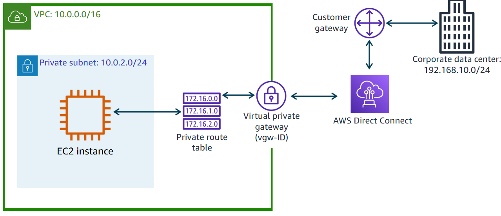

#services 

**AWS Direct Connect (DX)** is a **dedicated, private network connection** that links your on-premises infrastructure or colocation environment directly to AWS, **bypassing the public internet**. It offers **lower latency, more consistent performance, and increased security** compared to traditional internet-based connections like VPN.

# Features
| Feature                              | Description                                                                                  |
| ------------------------------------ | -------------------------------------------------------------------------------------------- |
| **Private Connectivity**             | Establishes a private, dedicated connection to AWS without traversing the internet.          |
| **High Bandwidth Options**           | Supports 1 Gbps, 10 Gbps, 100 Gbps dedicated connections (or sub-1 Gbps hosted connections). |
| **Virtual Interfaces (VIFs)**        | Create private or public virtual interfaces to access VPCs or AWS public services.           |
| **Integration with Transit Gateway** | Enables scalable, hub-and-spoke connectivity across multiple VPCs.                           |
| **Redundancy & Failover**            | Supports multiple connections for high availability and failover.                            |
| **Reduced Data Transfer Costs**      | Typically offers lower egress costs than internet-based transfer.                            |
# Use Cases
| Scenario                              | Description                                                       |
| ------------------------------------- | ----------------------------------------------------------------- |
| **Hybrid Cloud Architecture**         | Extend on-premises networks into AWS VPCs over a dedicated line.  |
| **Enterprise Applications**           | Run high-performance workloads (ERP, databases) with low latency. |
| **Large Data Transfers**              | Move large datasets securely (e.g., backups, analytics data).     |
| **Real-time Financial Trading**       | Applications requiring deterministic latency and low jitter.      |
| **Healthcare & Regulated Industries** | Compliance-driven applications that require private connectivity. |
# Cost
It follows pay-as-you-go model, charge for port hours and data transfer, to be more specific:
- **Port Hour Charges**:
    - 1 Gbps: ~$0.30/hour
    - 10 Gbps: ~$2.25/hour
- **Data Transfer**:
    - Lower than standard internet egress fees.
    - Region-specific pricing tiers apply.