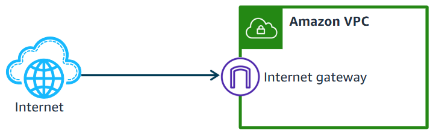

#config #resources
An internet gateway is a **horizontally scaled**, **redundant**, and **highly available** VPC component that enables communication between your VPC and the internet. 
To create an internet gateway, choose Create internet gateway, provide it with a name and tag, and then choose Create internet gateway. ***There are no configuration options to address.*** 
To use an internet gateway, attach it to your VPC ID. VPCs and internet gateways have a **one-to-one relationship.** In other words, you cannot attach an internet gateway to multiple VPCs, and each VPC can have only one internet gateway. After you have attached an internet gateway to a VPC, you can detach it and reattach it to another VPC.

