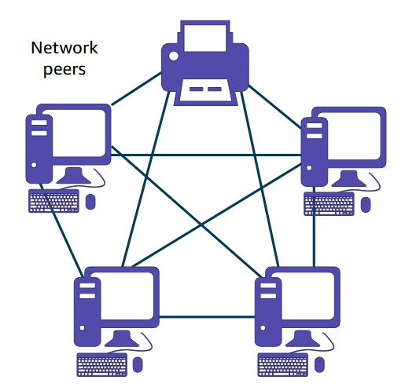
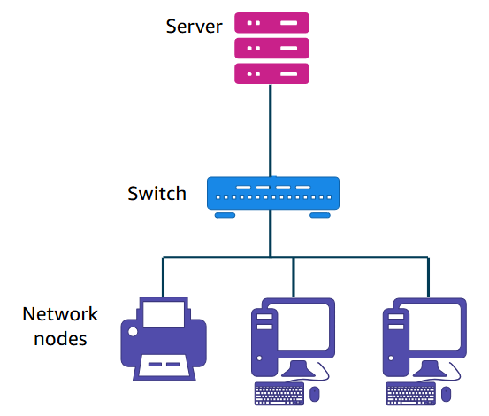
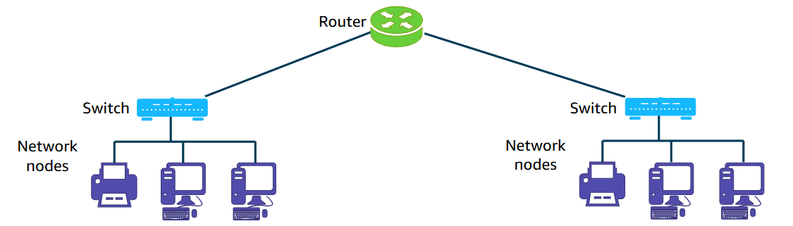
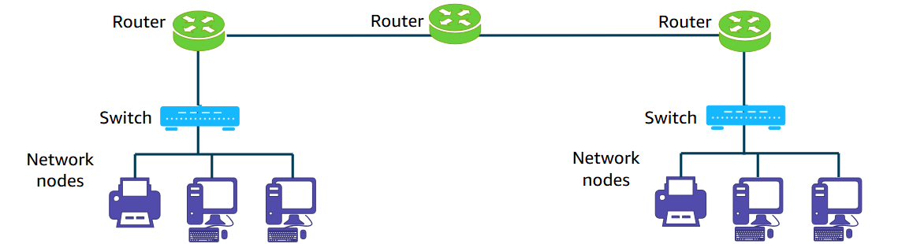

# Table of Content
# Networking
## Host Node
Centralized node (typically a server) that shares files, applications, and resources with other nodes on the network
Ex: File Servers, Email Servers, Web Service
## Client Node
Nodes that depend on the host node for files, applications, and resources
Ex: Computer, printer, mobile device
# Network Components
## Server
A server is a physical computer that runs software services that other computer devices or software can access. Servers are distinguished by the service that they provide. Common use cases for servers include the following:
+ Web server: Stores and distributes web pages and other web content by using HTTP
+ File server: Stores and distributes files
+ Database server: Stores databases and manages access to the databases
+ Print server: Controls and manages one or more remote printers on the network
+ Mail server: Stores and delivers email, like a digital post office
+ Proxy server: Improves security by acting as an intermediary for requests from clients that are seeking resources
## Router
A router is a network device that connects multiple network segments into one network. It's located at any gateway A (where one network meets another). The router connects multiple switches and their respective networks to enable communication between the different networks. It acts as a switch between networks and can also filter the data that flows through it. As soon as the router is connected, it can make intelligent decisions about how best to get network data to its destination. It bases these decisions on network performance data that it gathers from the network itself.
## Hubs and Switches
A hub is the device that connects all the nodes of a network together. Any transmitted data that is received on one port is rebroadcast to all the other ports on the hub. Therefore, if one node sends it, all the others receive it, but only the intended recipient listens to it.

Similar to a hub, a switch connects multiple nodes of a network together. However, they have an important difference.
A hub rebroadcasts any signal that it receives on one port to all the others. A switch makes a direct link between the transmitting device and receiving device. Any device that is not the intended target will not receive the transmission.
The benefit of a switch over a hub is that the switch improves performance because it doesn’t waste bandwidth on unnecessary transmissions.
## Internet Service Provider
An internet service provider (ISP) is an organization that provides internet access to its customers. Without the services that an ISP offers, you would not be able to access other networks on the internet.
## Cloud
The cloud is the on-demand delivery of IT resources over the internet. You don't need to buy, own, and maintain physical data centers and servers. Instead, you can access technology services, such as servers, storage, and databases, on an as-needed basis from a cloud provider like AWS.

Many networking architectures rely completely on servers in the cloud rather than on-premises servers. Other
networking architectures use a hybrid approach, which includes using servers in the cloud and servers on premises.

## Network Nodes
A network node or client is a computer hardware device that accesses a service under the management of another = computer hardware device, called a server. The server is typically located on a separate physical computer. The node or client must connect to the server over the network to access the service.

For example, suppose that you must access a collection of files that are shared among the workers in your organization.
A computer hardware device (the file server) is set up to store and distribute these files. When a user must access a file, they use their client hardware device, which is typically another computer. The client device connects to the file server over the network to retrieve the file.
Common examples of nodes on a network include the following:
- Computers
- Printers
- Fax machines
- Personal devices (cell phones, tablets, and others)

# [[OSI Model]]
# Network Models
## Peer-to-peer model
A peer-to-peer model refers to computer systems or peers that are connected to each other for the purpose of distributing workloads. They could also be used for sharing resources such as files, printers, and storage.

In a peer-to-peer network model, each node has its own data and applications and is responsible for its own management and security. Peers are equally privileged participants in the architecture.
For example, files can be shared directly between systems
on the network without the need for a central server.

Use cases:
- Users are responsible for backing up each node.
+ Security requirements are not restrictive.
+ A limited number of peers are used.
## Client-Server model
In a client-server network model, the data management and application hosting are centralized at the server and distributed to the clients. All clients on the network must use the designated server to access shared files and information that are stored on the serving computer.

If the **server goes down, no client is able to access the network** until the server is restored.

The following are examples of client-server models:
+ File server and desktop clients
+ Print server and desktop clients

Use case: Most business networking architectures
# Network Types
## LAN (Local Area Network)
A LAN **connects devices in a limited geographical area** such as a floor, building, or campus. LANs commonly use the Ethernet standard for connecting devices and usually **have a high data-transfer rate**. Wireless technology is also commonly used for a LAN.

## WAN (Wide Area Network)
A WAN connects devices in a large geographical area, such as in multiple cities or countries. WANs are used to connect LANs and use technologies such as fiber-optic cables and satellites to transmit data. The internet is considered to be the largest WAN.

# [[Subnets]]

# [[VPC (Virtual Private Cloud)]]

# [[AWS Networking Services]]