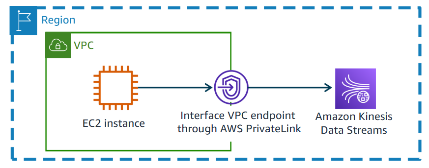
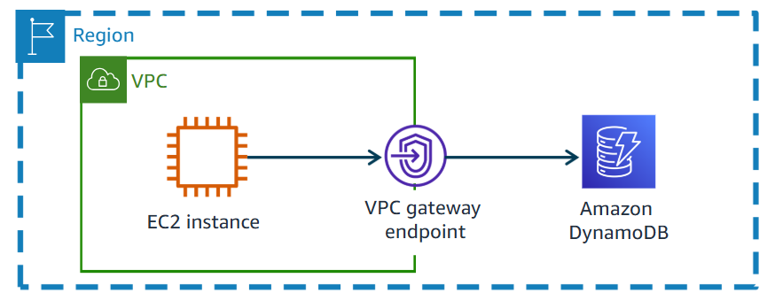

#resources 

A **VPC Endpoint** allows your VPC to **privately connect** to supported AWS services and VPC endpoint services **without requiring an Internet Gateway, NAT Gateway, or VPN connection**.
# Interface VPC Endpoints
 You can create interface VPC endpoints (interface endpoints), which you can use to connect to services that are powered by [[AWS PrivateLink]]. You are charged for creating and using an interface endpoint to a service.

# Gateway Endpoints
Gateway endpoints provide reliable connectivity to Amazon Simple Storage Service ([[Amazon S3]]) and [[Amazon DynamoDB]] **without requiring an internet gateway or a NAT device** for your VPC. Gateway endpoints do not enable AWS PrivateLink.

# Cost 
| Type                   | Cost Model                                                                      |
| ---------------------- | ------------------------------------------------------------------------------- |
| **Interface Endpoint** | Pay for **hourly usage (~$0.01/hour)** per AZ + **data processing (~$0.01/GB)** |
| **Gateway Endpoint**   | **Free** — no hourly charge, no data processing fee                             |
***Interface endpoints are cheaper than NAT Gateways for many services and more secure.***