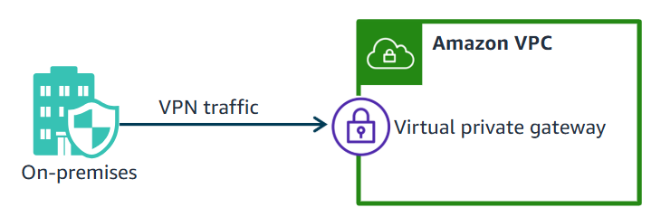

#resources

Amazon VPC lets you connect your on-premises site to your VPC. This connection is called a site-to-site VPN connection. A virtual private gateway is the VPN connector on the Amazon side of the site-to-site VPN connection. You create a virtual private gateway and attach it to the VPC ID that you want to use for the site-to-site VPN connection.
For the site-to-site VPN connection to work, the customer needs a customer gateway on the on-premises side of the site-to-site VPN connection.

