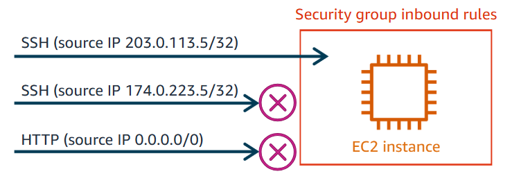
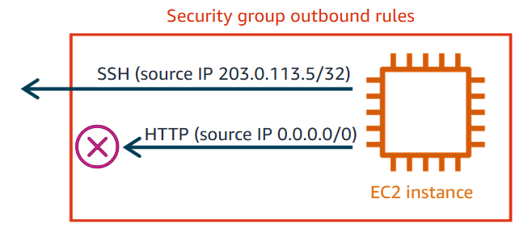
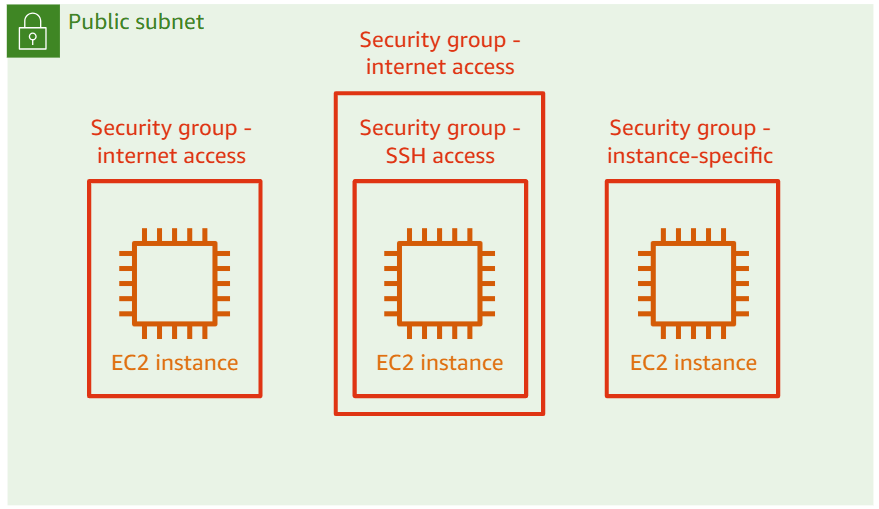

When you launch your EC2 instance, it will be protected by a security group that you select while configuring the instance. 
A security group acts as a **virtual firewall** for your EC2 instances to control incoming and outgoing traffic. 
You want to build your application to be highly available and fault tolerant. To do so, a best practice is to launch instances in multiple Availability Zones and attach an Elastic Load Balancer. An Elastic Load Balancer automatically distributes incoming application traffic across multiple targets and virtual instances in one or more Availability Zones.

# Rule features
- Filter traffic that's allowed to access your instance
- Specifies allow rules but not deny rules
- Can be modified at any time
- Update effects attached instances in real time
# Rule Components
## Type
The type is where you choose the specific type of protocol to open to network traffic. You can choose a common protocol, such as SSH (for a Linux instance), RDP (for a Windows instance), and HTTP and HTTPS to allow internet traffic to reach your instance.
## Protocol 
Internet protocols are different ways that computers and other services on the internet can send information to each other. The protocol section shows the protocol to allow for the protocol type.
The most common protocols are 6 (TCP), 17 (User Datagram Protocol, or UDP), and 1 (Internet Control Message Protocol, or ICMP).
## Port range
The port range verifies the ports that are allowed to pass traffic for each protocol type. You can specify a single port number (for example, 22), or range of port numbers (for example, 7000-8000).
## Source
The source is where you choose the source (inbound rules) or destination (outbound rules) for the traffic to reach. This option determines the traffic that can reach your instance. You can specify a single IP address, or a range of IP addresses. If the instance is hosting a web page, you can leave it open to all traffic on HTTP.

# Inbound and Outbound Rules
## Inbound rule
When you create a security group, it has no inbound rules. Therefore, no inbound traffic that originates from another host to your instance is allowed until you add inbound rules to the security group.

## Outbound rule
By default, a security group includes an outbound rule that allows all outbound traffic. You can remove the rule and add outbound rules that allow specific outbound traffic only.

If your security group has no outbound rules, no outbound traffic that originates from your instance is allowed.

# STATEFUL Attributes
For every inbound rule, an outbound rule exists, even if you don't configure one
For every outbound rule, an inbound rule exists, even if you don't configure one

If an inbound rule allows a protocol in, it must allow an outbound rule response
If an outbound rule allows a protocol out, it must allow an inbound rule response 

# Managing Security Group
+ Security groups act at the **INSTANCE LEVEL**, not the subnet level.
+ Instances in the same subnet can be assigned to a different security group.
+ You can attach **more than one** security group to an instance.
	+ Instance-specific security groups are recommended.
+ All the rules from all the security groups that are attached to an instance are evaluated before traffic is allowed to pass through.
