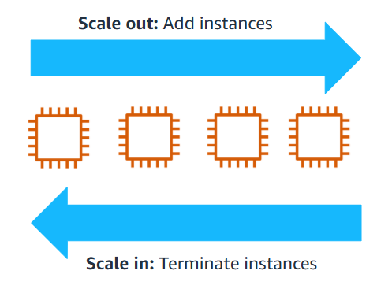

#terms 
Horizontal scaling is the process of **adding or removing Amazon EC2 instances depending on the traffic demands**. This process can be automated by using the Amazon EC2 Auto Scaling service. With horizontal scaling, you can add as many instances as you need for the computing job and terminate them when they are no longer needed.
### Benefits
- Improve fault tolerance
- Increase application availability
- Lower cost
- Requires no downtime to implement

