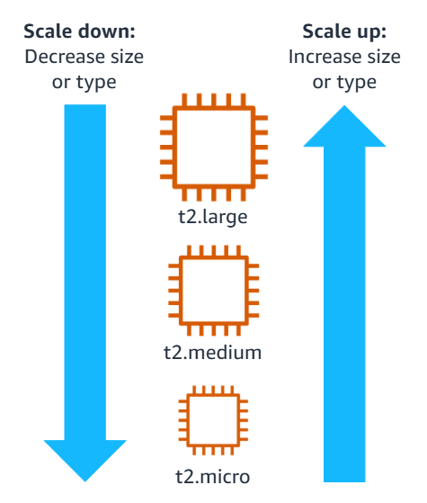

#terms 
Amazon EC2 gives you the option to scale your instances by **changing your instance type.** Thus, you can **scale up or down, as needed**, for computing power, memory, disk space and more. This process is called vertical scaling. 
To vertically scale an Amazon EC2 instance, you must complete the following three steps:
1. Stop the instance.
2. Make the desired change to the instance size or type.
3. Start the instance.
Disadvantages of vertical scaling include the following:
+ Manual process (but can be automated with AWS Lambda)
+ Challenging when you have multiple instances to manage 
+ Limited on the instance scalability
+ Requires the instance to be unavailable while making changes

